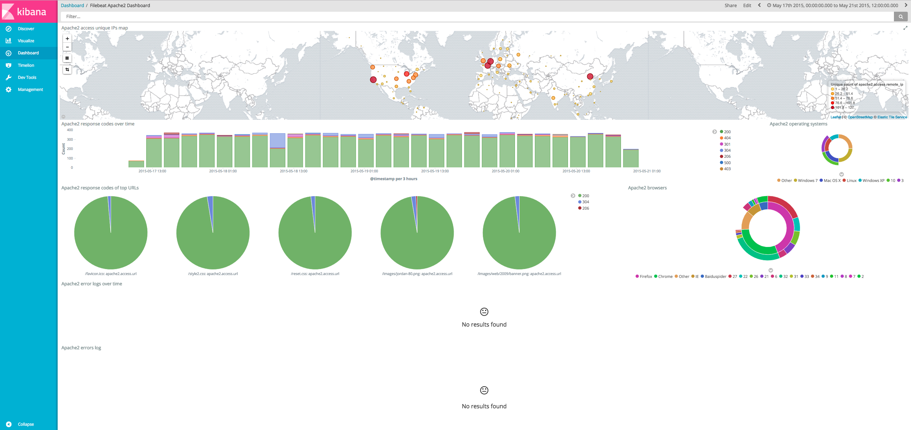
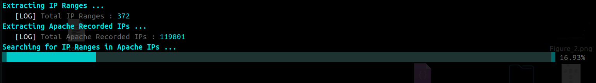

# Analyze-Apache-Logs
Shell Script to Use Commands and Methods to Extract or Find Info in Apache Log Files
<p align="center" style="position: relative;">
  
</p>

## Details
First i Extracted 3 First Parts of Iran IP Ranges from ```ir.csv``` File, then Compare IPs to Apache Logs IP to Find that Specific IP
<p align="center" style="position: relative;">
  
</p>

## Final Answer
Using My Shell Script, I Finally Found Answer in Only ```1``` Record from Total ```119801``` Records with IP Range of ```188.210.96```
<p align="center" style="position: relative;">
  
</p>

It Seems The Device that have Conducted the Apache Request is ```Samsung SGH E250```

<p align="left" style="position: relative;">
  
</p>
